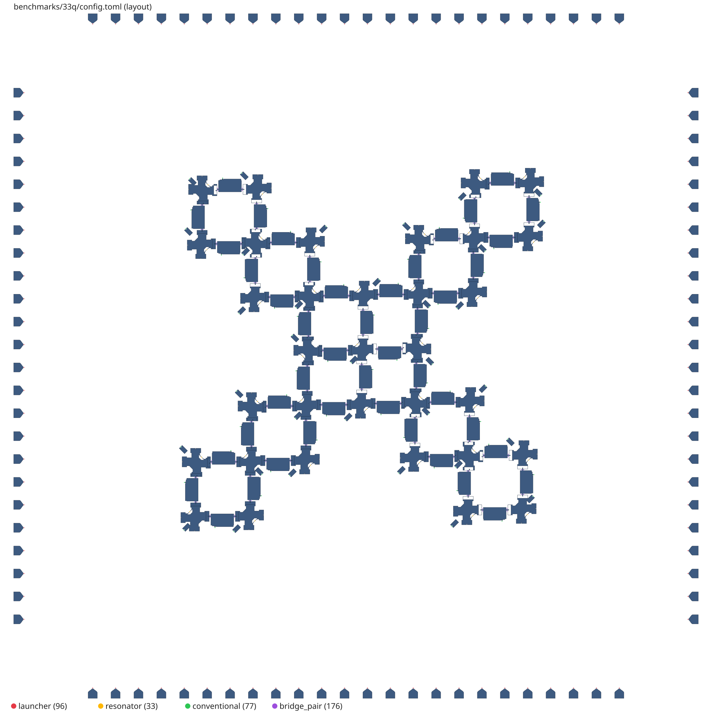

# Physical Design Automation for Planar Superconducting Quantum Chips

<p align="center">
  <picture>
    <source media="(prefers-color-scheme: dark)" srcset="https://raw.githubusercontent.com/munich-quantum-toolkit/.github/refs/heads/main/docs/_static/mqt-banner-dark.svg" width="90%">
    
  </picture>
</p>

This repository provides supplementary data for the paper *Physical Design Automation for Planar Superconducting
Quantum Chips* by **Michael Feldmeier, Marcel Walter, Gerhard B.P. Huber, Anirban Bhattacharjee, Stefan Filipp, and
Robert Wille** submitted to TCAD (under review).

All methods proposed in the paper are implemented in the open-source tool
[*MQT SCPD*](https://github.com/munich-quantum-toolkit/scpd), which is part of the
[*Munich Quantum Toolkit* (MQT)](https://mqt.readthedocs.io).

## Repository Structure

```text
.
├── layouts/
│   ├── unrouted/
│   │   ├── gds/    benchmark chips before routing (GDSII)
│   │   └── svg/    benchmark chips before routing (SVG)
│   └── routed/
│       ├── gds/    routed chips generated by the proposed flow (GDSII)
│       └── svg/    routed chips generated by the proposed flow (SVG)
└── qor/
    └── qor.csv     quality-of-results metrics of all benchmarks (Table I of the paper)
```

All files are named after their benchmark, e.g., `33q_unrouted.gds` or `33q_routed.svg`.

## Benchmark Layouts

The flow is evaluated on eight planar chips with 4 to 69 qubits. The chip inputs (obstacle polygons, terminals, and
routing configuration) are distributed with [*MQT SCPD*](https://github.com/munich-quantum-toolkit/scpd) in its
`benchmarks/` folder.

| Benchmark | Topology                                            | Layout size (W × H) [mm²] | Launcher ports |
|-----------|-----------------------------------------------------|--------------------------:|---------------:|
| 4Q        | 2×2 grid                                            |                     6.6×7 |             16 |
| 9Q        | 3×3 grid                                            |                 14.3×14.3 |             24 |
| 17Q       | 3×3 core with eight boundary qubits                 |                 14.3×14.3 |             48 |
| 21Q       | X-shaped, one 3-qubit block added at each corner    |                     24×24 |             72 |
| 33Q       | X-shaped, two 3-qubit blocks added at each corner   |                     30×30 |             96 |
| 45Q       | X-shaped, three 3-qubit blocks added at each corner |                     35×35 |            120 |
| 57Q       | X-shaped, four 3-qubit blocks added at each corner  |                     40×40 |            152 |
| 69Q       | X-shaped, five 3-qubit blocks added at each corner  |                     54×54 |            192 |

All benchmarks are routed under the same design rules: a minimum clearance of *d*<sub>clear</sub> = 185 µm, a minimum
straight length of *d*<sub>straight</sub> = 100 µm, and a minimum bending radius of *r*<sub>min</sub> = 50 µm. The
target resonator length *d*<sub>fix</sub> and the maximum feedline capacity *r*<sub>util</sub> are chosen per chip (see
[Quality of Results](#quality-of-results)); resonators in inner regions are routed to an adjusted length of
*d*<sub>fix</sub> + 3000 µm.

<p align="center">
  
  
</p>

### Unrouted Layouts

The unrouted layouts in [`layouts/unrouted/`](layouts/unrouted) are the input of the flow: the geometry of all qubits,
couplers, and launchers before any wire is routed.

The SVG files render the physical design of each chip before routing, in the same style as the
[routed layouts](#routed-layouts).

### Routed Layouts

The routed layouts in [`layouts/routed/`](layouts/routed) are the output of the proposed flow. In addition to the
components, they contain all launcher-to-port lines, meandered resonators, feedlines, CPW couplers, and airbridges.

The SVG files render the complete physical design of each routed chip: base metal in light gray, etched gaps in dark
gray, airbridges in black, and the routing exclusion zones as translucent overlays, i.e., red around wires and
resonators, yellow around the CPW couplers on the feedlines, and gray around the qubit drive lines.

### GDS Files

The GDS files of both the unrouted and the routed layouts contain the abstracted layout rather than the detailed
physical design. Coordinates are the layout coordinates of the chips in µm with a database unit of 1 nm, and the
single top cell is named after the chip, e.g., `33Q_routed`. The files use the following layers:

| Layer | Name           | Content                                                                                                           | Unrouted | Routed |
|-------|----------------|-------------------------------------------------------------------------------------------------------------------|:--------:|:------:|
| 1/0   | geometry       | Abstracted polygons of the qubits, couplers, and launchers (routing obstacles)                                    |    ✓     |   ✓    |
| 2/0   | wires          | Footprint of every routed wire, i.e., launcher-to-port lines, resonators, and feedlines, 22 µm wide (10 µm center conductor and two 6 µm gaps) |          |   ✓    |
| 3/0   | couplers       | CPW couplers between resonators and feedlines, drawn as their 200 µm × 182 µm footprint on the feedline         |          |   ✓    |
| 4/0   | bridges        | Airbridges at wire crossings                                                                                      |          |   ✓    |
| 5/0   | wire clearance | Zone of width *d*<sub>clear</sub> = 185 µm centered on every wire; the zones of two parallel wires touch at a center distance of exactly *d*<sub>clear</sub> |          |   ✓    |

## Quality of Results

The following table reproduces Table I of the paper. [`qor/qor.csv`](qor/qor.csv) provides the same values in
machine-readable form.

| Metric / Layout                                                           |    4Q |        9Q |       17Q |    21Q |    33Q |     45Q |     57Q |     69Q |
|---------------------------------------------------------------------------|------:|----------:|----------:|-------:|-------:|--------:|--------:|--------:|
| Layout size (W × H) [mm²]                                                 | 6.6×7 | 14.3×14.3 | 14.3×14.3 |  24×24 |  30×30 |   35×35 |   40×40 |   54×54 |
| Launcher ports                                                            |    16 |        24 |        48 |     72 |     96 |     120 |     152 |     192 |
| Feedline max. capacity *r*<sub>util</sub>                                 |     4 |         5 |         5 |      5 |      5 |       6 |       7 |       6 |
| Resonator length *d*<sub>fix</sub> [µm]                                   |  2500 |      3000 |      3000 |   4000 |   6000 |    6000 |    6000 |    6000 |
| &#124;*W*<sub>p</sub>&#124;                                               |     8 |        21 |        41 |     49 |     78 |     105 |     134 |     163 |
| &#124;*W*<sub>r</sub>&#124;                                               |     4 |         9 |        17 |     21 |     32 |      45 |      56 |      69 |
| &#124;*W*<sub>f</sub>&#124;                                               |     1 |         2 |         4 |      5 |      6 |       8 |       9 |      12 |
| p2p connections in *W*<sub>f</sub>                                        |     5 |        10 |        20 |     26 |     39 |      52 |      65 |      81 |
| Total p2p connections                                                     |    17 |        40 |        78 |     96 |    149 |     202 |     255 |     313 |
| Total wirelength in *W*<sub>p</sub> (*O*<sub>l</sub>) [mm]                | 10.32 |    109.38 |    174.65 | 433.95 | 867.30 | 1330.11 | 1947.72 | 3346.49 |
| Mean clearance in *W*<sub>p</sub>, *W*<sub>r</sub> (*O*<sub>c</sub>) [µm] | 454.11 |   295.62 |    198.88 | 286.08 | 263.04 |  251.18 |  228.26 |  227.70 |
| Total angles (*O*<sub>a</sub>) [45°]                                      |    80 |       240 |       518 |    677 |   1178 |    1704 |    2287 |    2964 |
| Bridges &#124;*C*<sub>b</sub>&#124; (*O*<sub>b</sub>)                     |     5 |        15 |        27 |     33 |     57 |      82 |     101 |     121 |
| ***Ratios & Scaling Analysis***                                           |       |           |           |        |        |         |         |         |
| Angle ratio                                                               |  4.71 |      6.00 |      6.64 |   7.05 |   7.91 |    8.44 |    8.97 |    9.47 |
| Bridge ratio                                                              |  0.42 |      0.50 |      0.47 |   0.47 |   0.52 |    0.55 |    0.53 |    0.52 |
| Clearance scaling                                                         |  0.80 |      0.62 |      0.81 |   0.83 |   0.96 |    1.08 |    1.08 |    0.98 |
| Total runtime [s]                                                         |  3.22 |     10.76 |     13.73 |  57.08 |  60.41 |  102.96 |  162.95 |  385.00 |
| Global partitioning [s]                                                   |  0.08 |      0.25 |      0.05 |   1.18 |   3.64 |    5.54 |   11.63 |   25.43 |
| Port assignment [s]                                                       |  0.03 |      0.41 |      0.60 |   0.39 |   0.69 |    1.86 |    3.01 |    4.12 |
| Routing [s]                                                               |  3.11 |     10.11 |     13.08 |  55.51 |  56.08 |   95.56 |  148.30 |  355.45 |

The metrics are defined as follows:

- **Total p2p connections**: &#124;*W*<sub>p</sub>&#124; + &#124;*W*<sub>r</sub>&#124; + p2p connections in
  *W*<sub>f</sub>.
- **Total wirelength (*O*<sub>l</sub>)**: total length of all launcher-to-port lines *W*<sub>p</sub>.
- **Mean clearance (*O*<sub>c</sub>)**: mean clearance between adjacent wires in *W*<sub>p</sub> and
  *W*<sub>r</sub>.
- **Total angles (*O*<sub>a</sub>)**: total count of angle transitions across all wire types, in units of 45°.
- **Bridges (*O*<sub>b</sub>)**: number of instantiated airbridges &#124;*C*<sub>b</sub>&#124;.
- **Angle ratio**: *O*<sub>a</sub> / total p2p connections.
- **Bridge ratio**: &#124;*C*<sub>b</sub>&#124; / (&#124;*W*<sub>p</sub>&#124; + &#124;*W*<sub>r</sub>&#124;).
- **Clearance scaling**: *O*<sub>c</sub> · (&#124;*W*<sub>p</sub>&#124; + &#124;*W*<sub>r</sub>&#124;) / √(W · H),
  with *O*<sub>c</sub>, W, and H in mm.

All methods are implemented in C++20 and use Gurobi as the ILP solver. All runtimes were measured on a macOS 15.7.7
machine with an Apple Silicon M4 Pro CPU and 24 GB of unified memory.

### CSV

[`qor/qor.csv`](qor/qor.csv) contains one row per benchmark and one column per metric of the table above. Column names
carry the unit where applicable:

```csv
benchmark,layout_width_mm,layout_height_mm,launcher_ports,feedline_max_capacity_r_util,...,runtime_routing_s
4Q,6.6,7,16,4,...,3.11
9Q,14.3,14.3,24,5,...,10.11
17Q,14.3,14.3,48,5,...,13.08
...
```

## Acknowledgements

The Munich Quantum Toolkit has been supported by the European Research Council (ERC) under the European Union's
Horizon 2020 research and innovation program (grant agreement No. 101001318), the Bavarian State Ministry for Science
and Arts through the Distinguished Professorship Program, as well as the Munich Quantum Valley, which is supported by
the Bavarian state government with funds from the Hightech Agenda Bayern Plus.

<p align="center">
  <picture>
    <source media="(prefers-color-scheme: dark)" srcset="https://raw.githubusercontent.com/munich-quantum-toolkit/.github/refs/heads/main/docs/_static/mqt-funding-footer-dark.svg" width="90%">
    
  </picture>
</p>
